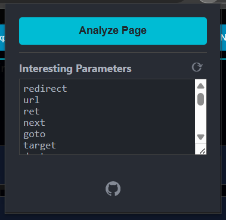
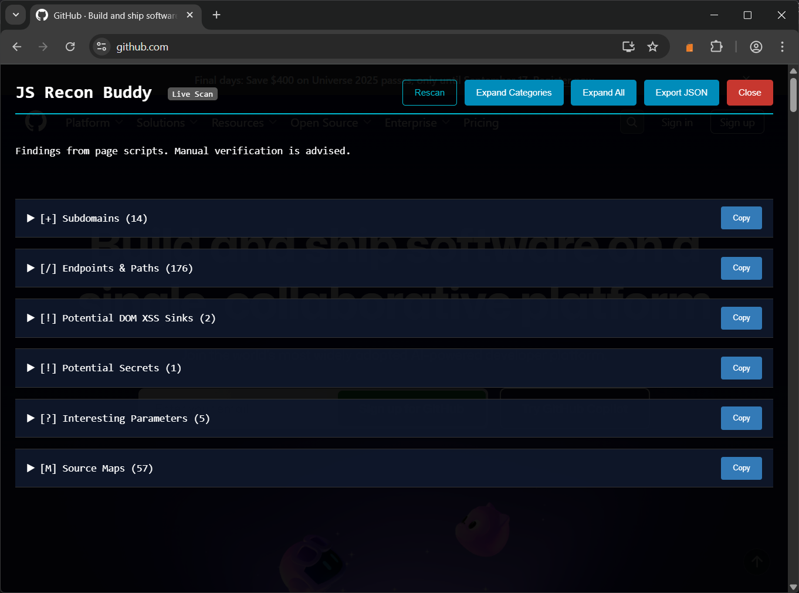
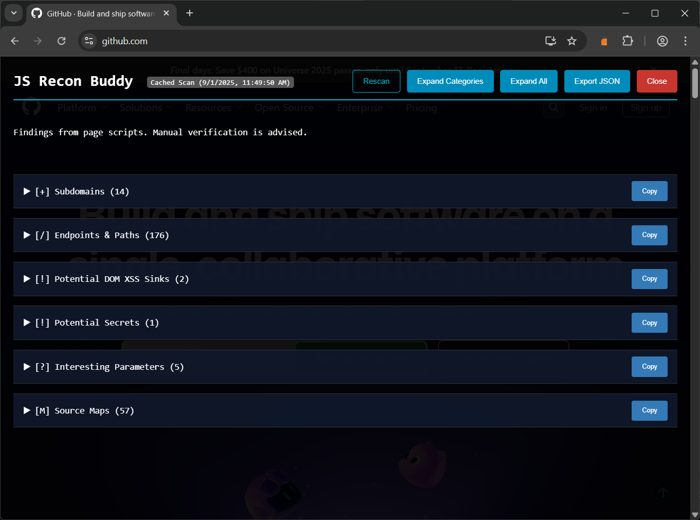
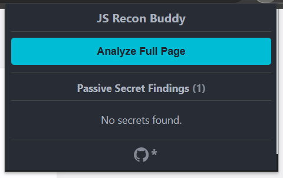
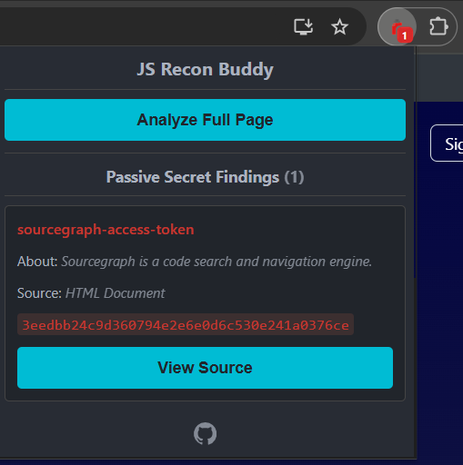
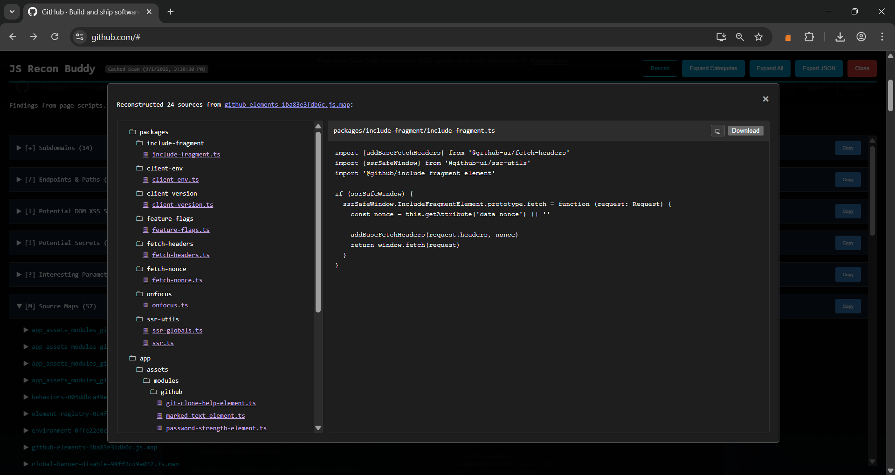
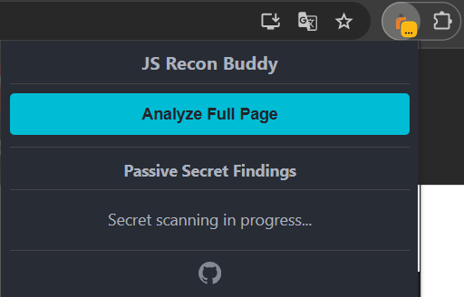
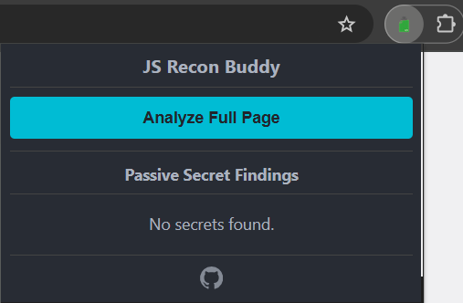
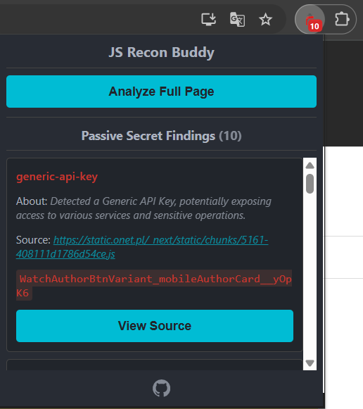
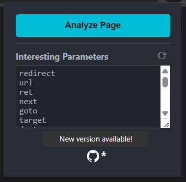

    

    <strong>JS Recon Buddy</strong>

A simple browser extension to quickly find interesting security-related information on a webpage. It injects an overlay to display its findings without interrupting your workflow.

## Features

- On-Page Overlay - all results are displayed in an overlay directly on the page you're testing.
- Comprehensive Scan - analyzes inline scripts, external JavaScript files, and the main HTML document.
- Categorized Findings - organizes results into logical categories for clear and easy analysis.
- Interactive Results - easily copy individual sections or export all findings to a JSON file for further use.

## What it finds?

The scanner uses a set of regex patterns to identify and categorize potential security-related information:

- Subdomains - discovers related subdomains within the code.
- Endpoints & Paths - uncovers potential API endpoints and other useful paths.
- Potential Secrets - scans for API keys, tokens, and other sensitive data using pattern matching and Shannon entropy checks.
- Potential DOM XSS Sinks - identifies dangerous properties and functions like .innerHTML and document.write.
- Interesting Parameters - flags potentially vulnerable URL parameters (e.g., redirect, debug, url).
- Source Maps - finds links to source maps which can expose original source code.
> If it is a valid source map, the extension tries to deconstruct source files based on data there
- JS Libraries - lists identified JavaScript libraries and their versions.

## Why this exists?

This project was inspired by the simple yet powerful JavaScript bookmarklets popular in the bug bounty community, such as:

- https://x.com/grumpzsux/status/1830317635629949134
- https://x.com/Evan_Connelly/status/1830407433480450318
- https://github.com/0dayCTF/endlets
- ...and more iterations of the similar nature

While those are great for a quick look, they have a few key limitations:

- Modifying a bookmarklet to add new patterns or change its functionality is a pain. 
- Most are hardcoded to find specific things, like just endpoints. Adding new scanners for secrets or parameters isn't straightforward.
- CORS...Bookmarklets [have hard time analyzing](https://medium.com/making-instapaper/bookmarklets-are-dead-d470d4bbb626) scripts from other domains, leaving major blind spots.

Another major inspiration was the original [TruffleHog Chrome Extension](https://github.com/trufflesecurity/Trufflehog-Chrome-Extension). While it was a great concept, it always annoyed me with its intrusive popups for every finding, and it hasn't been maintained for the last 4 years. I am also a huge fan of Gitleaks and use it in my projects, so I thought, why not combine these ideas?

JS Recon Buddy was built to solve these problems. It takes the great idea of a recon bookmarklet and a browser-based secret scanner and makes them more powerful and customizable.

## Examples

- Extension's popup

	

- First scan of a given website

	

- Cached results of a given website

	

- New version is available on Github

	

- Extension found secrets in the background

	

- Deconstructed source map

	

## How to Install or Update?

Since this extension is not on the Chrome Web Store, it must be loaded as an unpacked extension in developer mode.

1. Download [ZIP from releases](https://github.com/TheArqsz/JSRecon-Buddy/releases/latest/download/js-recon-buddy.zip) or clone this repository to your local machine.
   
   > If downloaded as a file, unzip it to a directory called e.g. `js-recon-buddy`.
3. Open Google Chrome (or other chromium-based browser) and navigate to chrome://extensions.
4. Turn on "Developer mode" using the toggle in the top-right corner.
5. Click the "Load unpacked" button.
6. Select the directory where you cloned the repository or unzipped the archive.

The extension will now be installed or updated.

## How to use?

### Main usage

1. Navigate to the target website.
2. Click the extension icon in your browser's toolbar.
4. Press 'Analyze full page'
5. An overlay will appear and automatically start scanning the page.
    - If you've analyzed this page before, it will instantly show the cached results (indicated in the top-left corner) while a new scan runs.
    - You can rescan the page again if you want
7. Review the categorized findings!

### Passive secret scanning

In addition to the on-demand full analysis, JS Recon Buddy automatically performs a passive scan for secrets on every page you visit. This feature is designed to provide at-a-glance awareness of potential secret leaks without any user interaction. The results of this background scan are reflected directly in the extension's toolbar icon. This entire process happens within your browser using only the regular expressions bundled with the extension - **no findings** or **page data** are ever sent to an external server.

#### Icon Status Indicators

The extension icon changes color and uses a small badge (the notification on the corner) to communicate the status of the passive scan in real-time. 

By clicking the icon, you can open the popup to view a detailed list of these passively found secrets and inspect their source, all without needing to run the full page analysis. This ensures you never miss a potential finding while browsing.

- **Scanning (Yellow)** - when a page is loading, the icon turns yellow with a "..." badge, indicating that the passive scan is in progress.

> If the icon is yellow, without the indicator, it means that the webpage cannot be scanned or there was an error within the extension 

	

- **No Secrets Found (Green)** - once the scan is complete, a green icon means that no secrets were found in the page's HTML or scripts, based on our rules.

	

- **Secrets Found (Red)** - the icon turns red and displays a badge with a number, showing exactly how many potential secrets were discovered.

	

### Source maps deconstruction

If you want to view deconstructed source files, click on the Source Map entry, then on the url. What you will see, is the source code as available in the source map itself.

	

## Automatic version check

The extension automatically checks for new versions. When you open the popup, it compares its own version against the [manifest.json](manifest.json) file in this GitHub repository. To avoid excessive requests, the latest version number is cached for 6 hours. If a newer version is available on GitHub, an asterisk will appear on the GitHub logo in the popup.

	

## Contributing

Contributions are welcome! Whether it's a bug report, a feature request, or a pull request, all help is appreciated - get started [here](CONTRIBUTING.md).

## License

This project is licensed under the MIT License - see the [LICENSE](LICENSE) file for details.

## Acknowledgments

The secret detection patterns in [rules.js](src/utils/rules.js) were heavily inspired by [the comprehensive rule set](https://github.com/gitleaks/gitleaks/blob/master/config/gitleaks.toml) from the fantastic open-source project, Gitleaks, which I've adapted and expanded upon. A big thanks to the Gitleaks creators and contributors for providing such a great foundation, which is distributed under the MIT License.

A special thanks goes to the many security researchers in the bug bounty community whose clever JavaScript bookmarklets were the original inspiration for this extension and to the creators of the original [TruffleHog Chrome Extension](https://github.com/trufflesecurity/Trufflehog-Chrome-Extension).

## Disclaimer

This tool is intended for **educational** and **authorized** security testing purposes only. Do not use this tool on any system or website for which you do not have explicit, prior authorization. The author accepts no liability and is not responsible for any misuse or damage caused by this program. Use at your own risk.
